# Rapport de Projet : Prédiction de la performance des chevaux en course hippique

## 1. Introduction et Objectifs

Les courses hippiques constituent un environnement particulièrement complexe, où la performance dépend d’une combinaison de facteurs liés au cheval, aux conditions de course, aux acteurs (jockey, entraîneur) ainsi qu’aux anticipations du marché des paris. Dans ce contexte, la capacité à prédire la performance d’un cheval représente un enjeu à la fois analytique et économique.

L’objectif de ce projet est de prédire la performance d’un cheval lors d’une course hippique à partir d’un ensemble de variables décrivant les caractéristiques du cheval, de la course, du jockey, de l’entraîneur, ainsi que des informations issues du marché des paris.

La variable cible retenue n’est pas la position exacte à l’arrivée, mais une variable binaire pos3, indiquant si le cheval termine dans les trois premières positions.

Ce choix méthodologique repose sur plusieurs arguments. D’une part, la position exacte à l’arrivée est une variable fortement bruitée, influencée par de nombreux aléas (conditions de course, incidents, stratégie de course), ce qui rend sa prédiction fine particulièrement instable. D’autre part, les écarts entre certaines positions (par exemple entre une 4e et une 5e place) sont peu informatifs du point de vue de la performance réelle.

Surtout, le choix du top 3 s’inscrit dans une logique métier propre aux paris hippiques. En effet, de nombreux types de paris (placé, couplé, trio, etc.) reposent précisément sur la capacité d’un cheval à finir parmi les trois premiers. Prédire cette information permet donc de se rapprocher d’un objectif économique concret : identifier des chevaux offrant une probabilité élevée de gain. Ainsi, la variable pos3 constitue un compromis pertinent entre robustesse statistique et utilité opérationnelle.

La problématique du projet peut donc être formulée ainsi :
dans quelle mesure les caractéristiques observables d’une course permettent-elles de prédire la probabilité qu’un cheval termine parmi les trois premiers ?

Le jeu de données utilisé contient un ensemble d’observations de courses hippiques, avec des variables numériques et catégorielles décrivant différents aspects de la compétition.
Les données utilisées dans ce projet proviennent du jeu de données Kaggle *Horse Racing Results (UK/Ireland, 2015–2025)*, mis à disposition par Deltaromeo. Après extraction et préparation, la base mobilisée couvre des courses observées entre 2015 et 2026 et représente environ 1 800 000 lignes pour 37 colonnes. Ce jeu de données rassemble des informations sur les chevaux, les courses, les jockeys, les entraîneurs ainsi que certaines variables liées au marché des paris.

Afin de répondre à cette problématique, la démarche adoptée repose sur les étapes suivantes :

- Analyse exploratoire des données
- Traitement des valeurs manquantes
- Transformation et création de variables
- Construction d’un pipeline de modélisation
- Comparaison de plusieurs modèles de machine learning
- Analyse des performances et interprétation des résultats

---

## 2. Préparation des données et Analyse Exploratoire
Avant toute phase de modélisation, une étape essentielle consiste à préparer les données et à en comprendre la structure. Cette phase permet à la fois d’assurer la qualité des données utilisées, d’identifier d’éventuels biais, et d’orienter les choix méthodologiques pour la suite de l’analyse.

### 2.1. Réduction préalable du volume de données

Avant la séparation entre échantillon d’apprentissage et échantillon de test, une réduction du volume de données a été effectuée. En effet, la taille initiale du jeu de données était trop importante pour permettre des temps de calcul raisonnables, en particulier lors des phases de modélisation et de comparaison de plusieurs algorithmes.

Plutôt que de procéder à un échantillonnage aléatoire global, j'ai  choisi de conserver 20 % des observations pour chaque combinaison de la variable cible (`top3`) et de la variable temporelle (`date`). Cette stratégie permet de réduire la taille du dataset tout en préservant au mieux sa structure, notamment la répartition des classes au fil du temps.

Ainsi, cette étape vise à obtenir un sous-échantillon plus léger à manipuler, sans déformer excessivement la distribution de la variable cible ni la dimension temporelle des données.

### 2.2. Stratégie de séparation des données (Train/Test Split)

La séparation entre les données d’apprentissage et de test a été réalisée selon une logique temporelle et non aléatoire.

Les observations les plus anciennes sont utilisées pour l’entraînement, tandis que les plus récentes servent à l’évaluation du modèle.

Ce choix est central dans le cadre de ce projet pour plusieurs raisons :

- il respecte la chronologie des événements
- il évite les phénomènes de fuite d’information (data leakage)
- il reproduit une situation réaliste de prédiction, où l’on cherche à anticiper des résultats futurs à partir de données passées

À l’inverse, un découpage aléatoire aurait introduit un biais en mélangeant des observations passées et futures, conduisant à une surestimation des performances du modèle.

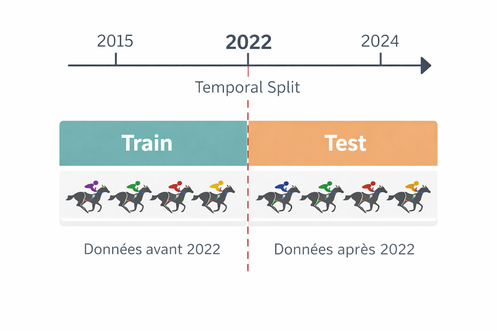

### 2.3. Analyse exploratoire des variables

Une analyse descriptive a été réalisée afin de comprendre la structure des données.

``Distribution des variables``

Certaines variables présentent une forte asymétrie, notamment :

jockey_freq
trainer_freq
sp_prob

Ces distributions sont caractérisées par :

- une forte concentration de petites valeurs
- quelques valeurs extrêmes élevées

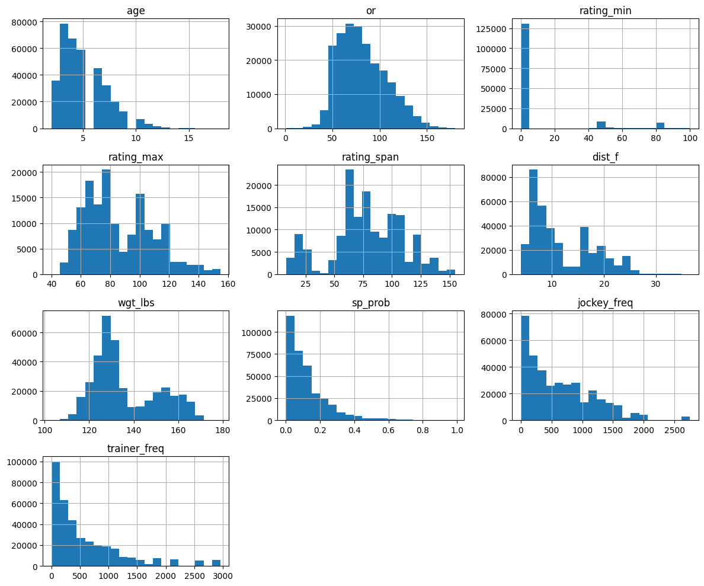

 ces propriétés suggèrent que certaines variables peuvent nécessiter des transformations (par exemple logarithmiques) et peuvent poser problème pour certains modèles sensibles aux distributions, comme les modèles linéaires.

``Analyse des corrélations``

Une analyse des corrélations entre variables explicatives a été effectuée afin d’identifier :

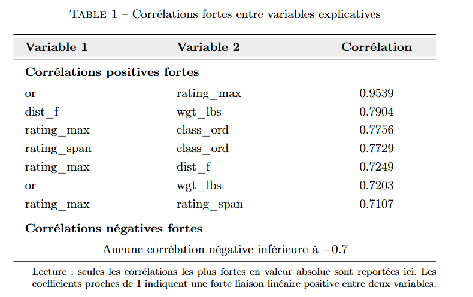

L’analyse de la matrice de corrélation met en évidence l’existence de plusieurs corrélations positives élevées entre variables explicatives.

En particulier, la corrélation très forte observée entre le rating officiel du cheval (or) et le rating maximal de la course (rating_max) (0,95) suggère une proximité informationnelle importante entre ces deux indicateurs de niveau. Ces deux variables semblent ainsi capter une information très similaire relative à la qualité du cheval et au niveau global de la course.

D’autres corrélations élevées apparaissent également :

- entre la distance de la course (dist_f) et le poids porté (wgt_lbs) (0,79), ce qui peut refléter des mécanismes structurels propres à l’organisation des courses
- entre rating_max et class_ord (0,78), ainsi qu’entre rating_span et class_ord (0,77), suggérant un lien étroit entre les caractéristiques de classification des courses et les niveaux de rating
- entre rating_max et dist_f (0,72), ainsi qu’entre or et wgt_lbs (0,72)
- enfin, entre rating_max et rating_span (0,71), ce qui est cohérent compte tenu de la construction de ces variables

Au total, sept couples de variables présentent des corrélations élevées (supérieures à 0,7 en valeur absolue), tandis qu’aucune corrélation négative forte n’est observée.

Ces résultats soulèvent la question d’un risque potentiel de multicolinéarité dans les modèles économétriques ou prédictifs. Toutefois, la présence de corrélations élevées ne justifie pas nécessairement la suppression immédiate des variables. En effet, certaines peuvent conserver une valeur prédictive propre, notamment dans des modèles non linéaires c'est pourquoi j'ai décidé de les garder.

``Lien avec la variable cible``

L’analyse des corrélations avec la variable cible (top3) met en évidence le rôle prédominant de certaines variables.

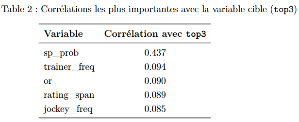

En particulier, sp_prob présente de loin la corrélation la plus élevée (0,437), ce qui souligne l’importance des anticipations du marché des paris dans la prédiction de la performance. Ce résultat est cohérent avec l’idée que les cotes agrègent une information riche sur les chances de succès d’un cheval.

Les autres variables présentent des corrélations plus modestes, notamment :

- trainer_freq (0,094)
- or (0,090)
- rating_span (0,089)
- jockey_freq (0,085)

Ces résultats suggèrent que, prises individuellement, ces variables ont un pouvoir explicatif limité, mais qu’elles peuvent contribuer de manière complémentaire à la prédiction.

Ainsi, la performance semble dépendre d’une combinaison de facteurs plutôt que d’une seule variable dominante, ce qui justifie le recours à des modèles capables de capter des relations complexes et non linéaires.

### 2.4. Gestion des valeurs manquantes

Certaines variables présentent des valeurs manquantes, qui peuvent être de nature différente :

- accidentelle (erreur de collecte, donnée non renseignée)
- structurelle (par exemple absence de rating pour certains chevaux n’ayant pas encore été suffisamment évalués)

Il est donc nécessaire de traiter ces valeurs afin de rendre les données compatibles avec les modèles de machine learning, qui ne peuvent généralement pas gérer les valeurs manquantes directement.

Une imputation par la médiane a été appliquée aux variables numériques. Ce choix repose sur plusieurs arguments :

- la médiane est robuste aux valeurs extrêmes, ce qui est particulièrement important compte tenu de la présence de distributions asymétriques observées précédemment
- elle permet de ne pas déformer la distribution des variables, contrairement à la moyenne dans certains cas
- elle constitue une solution simple et stable, adaptée dans un premier cadre de modélisation

Cependant, dans certains cas, l’absence d’information peut elle-même porter du sens. C’est notamment le cas de la variable `or` : un cheval sans rating peut correspondre à un profil particulier (débutant, peu expérimenté), ce qui peut influencer sa performance.

Afin de conserver cette information, une variable indicatrice `or_missing` a été introduite. Cette approche permet de distinguer :

- les valeurs réellement faibles
- les valeurs imputées correspondant à une absence d’information

Ainsi, le traitement des valeurs manquantes combine à la fois une stratégie d’imputation robuste et une prise en compte du caractère informatif de certaines absences, ce qui permet de maximiser l’information disponible pour les modèles.

--- 

## 3. Prétraitement et transformation des variables
Après l’analyse exploratoire, une étape de transformation des variables a été réalisée afin d’améliorer leur qualité et leur pertinence pour la modélisation. Cette phase vise à rendre les données plus informatives, à faciliter l’apprentissage des modèles et à limiter certains biais liés aux distributions initiales.

### 3.1. Feature Engineering

Plusieurs transformations et créations de variables ont été réalisées afin d’enrichir l’information disponible et de mieux capturer certaines caractéristiques structurelles des courses et des chevaux.

En particulier, la variable `rating_min` a été transformée en une variable binaire `has_rating_min`, indiquant la présence ou non d’un seuil minimal de rating dans la course. Cette transformation permet de distinguer :

- les courses avec contrainte de niveau (sélection des chevaux)
- les courses plus ouvertes

Ce type de variable permet de capter des différences de structure entre les courses, susceptibles d’influencer la probabilité pour un cheval de terminer dans le top 3.

Par ailleurs, certaines variables catégorielles ont été simplifiées afin de réduire la dimension et d’améliorer leur interprétabilité. C’est notamment le cas de la variable `sex`, regroupée en catégories plus larges (sex_simple), permettant de limiter la dispersion de l’information.

Enfin, certaines variables issues du marché des paris et des performances passées (jockey_freq, trainer_freq, sp_prob) ont été transformées (voir section suivante) afin d’être mieux exploitées par les modèles.

Dans l’ensemble, ces transformations visent à enrichir la représentation des données tout en conservant une interprétabilité suffisante, élément important dans un cadre d’analyse appliquée.

### 3.2. Transformation logarithmique

Certaines variables présentaient des distributions fortement asymétriques, avec la présence de valeurs extrêmes. Afin de corriger ces effets, une transformation logarithmique (log1p) a été appliquée aux variables suivantes :

- jockey_freq
- trainer_freq
- sp_prob

Cette transformation poursuit plusieurs objectifs :

- réduire l’asymétrie des distributions
- atténuer l’influence des valeurs extrêmes
- faciliter l’apprentissage des modèles, notamment pour les méthodes sensibles à l’échelle des variables

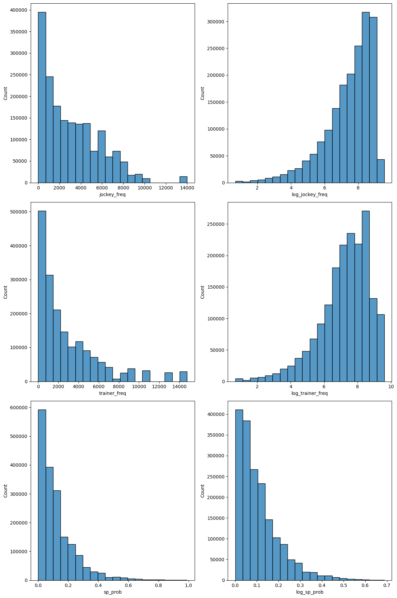

La transformation permet ainsi d’obtenir des variables plus “régulières”, ce qui améliore la stabilité et la performance des modèles

### 3.3. Préparation pour la modélisation

Les différentes transformations ont été réalisées en amont de la modélisation, directement sur le jeu de données. Cette étape inclut notamment la création de nouvelles variables, les transformations logarithmiques et le traitement des valeurs manquantes.

L’imputation des variables numériques a ensuite été appliquée séparément sur les données d’entraînement, puis reproduite sur les données de test, afin d’éviter toute fuite d’information. Plus précisément, la médiane a été estimée sur l’échantillon d’apprentissage uniquement, puis appliquée à l’échantillon de test.

### 3.4. Standardisation des variables

Certains modèles utilisés dans ce projet, notamment les modèles linéaires et les machines à vecteurs de support (SVM), sont sensibles à l’échelle des variables. En effet, ces modèles reposent sur des distances ou des combinaisons linéaires, ce qui peut entraîner un poids disproportionné des variables ayant des amplitudes élevées.

Afin de corriger ce problème, une standardisation des variables (centrage-réduction) a été appliquée pour ces modèles. Cette transformation permet d’obtenir des variables de moyenne nulle et d’écart-type égal à 1, garantissant ainsi une contribution équilibrée de chaque variable dans le processus d’apprentissage.

À l’inverse, cette étape n’a pas été appliquée aux modèles basés sur les arbres (Random Forest, XGBoost), qui ne sont pas sensibles à l’échelle des variables.

### 3.5. Synthèse des variables utilisées

À l’issue des différentes étapes de prétraitement et de transformation, l’ensemble des variables utilisées pour la modélisation peut être structuré selon plusieurs catégories.

Cette organisation permet de mieux comprendre la nature des informations mobilisées, en distinguant notamment les caractéristiques du cheval, de la course, ainsi que les variables issues du marché des paris et du feature engineering.

Le tableau suivant présente une synthèse des variables retenues.

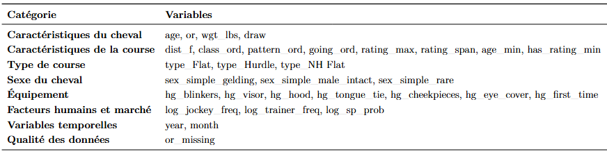

## 4. Modélisation et comparaison des modèles

Afin de répondre à l’objectif de prédiction, plusieurs modèles de classification ont été testés et comparés. L’enjeu est d’identifier l’approche la plus pertinente pour estimer la probabilité qu’un cheval termine parmi les trois premiers, en tenant compte à la fois de la performance prédictive et de la nature des relations entre les variables explicatives.

### 4.1. Régression logistique

La régression logistique constitue un premier modèle de référence pour ce problème de classification binaire.

Elle présente plusieurs avantages : sa mise en œuvre est simple, ses résultats sont relativement faciles à interpréter, et elle permet d’obtenir une première lecture des relations entre les variables explicatives et la probabilité qu’un cheval termine dans le top 3.

En revanche, ce modèle repose sur une structure linéaire, ce qui limite sa capacité à représenter des effets non linéaires ou des interactions complexes entre variables.

### 4.2. SVM linéaire

Un modèle de type SVM linéaire a également été testé. Ce type de méthode cherche à construire une frontière de séparation optimale entre les deux classes.

L’intérêt du SVM réside dans sa capacité à bien fonctionner dans des espaces de dimension élevée et à produire une frontière de décision robuste. Dans sa version linéaire, il reste toutefois limité lorsque les relations entre variables et variable cible sont fortement non linéaires.

Comme pour la régression logistique, la standardisation des variables est ici importante, car le modèle est sensible à l’échelle des données.

### 4.3. K plus proches voisins (KNN)

Le modèle KNN repose sur une logique de proximité : une observation est classée en fonction des classes de ses voisins les plus proches dans l’espace des variables.

Cette méthode est intéressante car elle ne suppose pas de forme fonctionnelle particulière et peut capturer certaines structures locales dans les données. En revanche, ses performances peuvent être affectées par la dimension élevée, la présence de bruit, ainsi que par l’échelle des variables, ce qui justifie également l’utilisation d’une standardisation.

### 4.4. Bagging Classifier

Le Bagging Classifier repose sur l’agrégation de plusieurs modèles entraînés sur différents sous-échantillons des données. L’objectif est de réduire la variance du modèle final et d’améliorer sa stabilité.

Cette approche est particulièrement utile lorsque les modèles de base sont sensibles aux fluctuations de l’échantillon. Elle permet ainsi d’obtenir une prédiction plus robuste que celle produite par un seul estimateur.

### 4.5. Random Forest

Le modèle Random Forest constitue une extension du bagging appliquée à des arbres de décision, avec en plus une sélection aléatoire des variables à chaque séparation.

Ce modèle présente plusieurs avantages dans le cadre de ce projet : il capture naturellement les non-linéarités et les interactions entre variables, il est robuste au bruit et aux valeurs extrêmes, et il limite le surapprentissage grâce au principe d’agrégation.

### 4.6. XGBoost

Le modèle XGBoost est une méthode de boosting fondée sur une construction séquentielle d’arbres, chaque nouvel arbre cherchant à corriger les erreurs des précédents.

Ce modèle est particulièrement performant lorsqu’il existe des relations complexes entre les variables explicatives et la variable cible. Il permet de capter des effets non linéaires, des interactions, et intègre des mécanismes de régularisation qui limitent le surapprentissage.

Dans ce projet, XGBoost est mobilisé dans une logique de maximisation des performances prédictives.

### 4.7. Optimisation des hyperparamètres

Au-delà du choix des algorithmes, une étape d’ajustement des hyperparamètres a été menée afin d’améliorer les performances des modèles les plus prometteurs.

Selon les modèles, plusieurs paramètres ont été ajustés, notamment :

- le nombre d’estimateurs
- la profondeur des arbres
- le taux d’apprentissage pour XGBoost
- les paramètres influençant la complexité ou la régularisation des modèles

### 4.8. Évaluation des performances

L’évaluation des modèles a été réalisée sur l’échantillon de test à l’aide de plusieurs métriques complémentaires : l’accuracy, la précision, le rappel, le score F1 et l’aire sous la courbe ROC (ROC-AUC).

Le recours à plusieurs indicateurs est nécessaire, car une seule métrique ne suffit pas à rendre compte de la qualité d’un modèle de classification. En particulier :

- l’accuracy mesure la proportion globale de bonnes prédictions
- la précision indique la part des chevaux prédits dans le top 3 qui y figurent réellement
- le rappel mesure la capacité du modèle à identifier les chevaux finissant effectivement dans le top 3
- le score F1 propose un compromis entre précision et rappel
- le ROC-AUC évalue la capacité du modèle à discriminer les deux classes indépendamment d’un seuil précis de classification

---

## 5. Résultats et interprétations

Après avoir entraîné les différents modèles, leurs performances ont été évaluées sur l’échantillon de test à l’aide des métriques présentées précédemment.

Le tableau suivant synthétise les résultats obtenus pour chaque modèle.

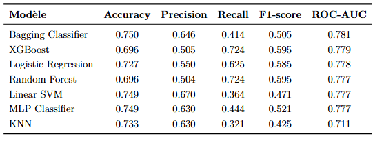

### 5.1. Comparaison des performances

L’analyse des résultats met en évidence des différences notables entre les modèles.

Le ***Bagging Classifier** présente la meilleure performance en termes de ROC-AUC (0,781), suivi de très près par **XGBoost** (0,779) et la **régression logistique** (0,778). Le **Random Forest** obtient également des résultats similaires (0,777), confirmant la pertinence des modèles basés sur des arbres.

En revanche, certains modèles comme le **KNN** affichent des performances plus faibles, notamment en termes de rappel (0,321), ce qui indique une difficulté à identifier correctement les chevaux terminant dans le top 3.

Les modèles présentent également des profils différents :

**XGBoost** et **Random Forest** ont un rappel élevé (0,724), ce qui signifie qu’ils identifient bien les chevaux performants
la régression logistique offre un compromis plus équilibré
le **SVM linéaire** présente une bonne précision mais un rappel plus faible

Ces résultats montrent que le choix du modèle dépend du compromis souhaité entre précision et capacité à détecter les chevaux performants.

### 5.2. Analyse des modèles les plus performants

Au regard des résultats, les modèles les plus pertinents sont Random Forest et XGBoost, qui offrent un bon équilibre entre performance et capacité à capturer des relations complexes.

Les performances proches de ces deux modèles suggèrent que les relations entre variables explicatives et variable cible sont effectivement non linéaires, ce qui confirme les observations faites lors de l’analyse exploratoire.

### 5.3. Optimisation des modèles (tuning)

Une étape d’optimisation des hyperparamètres a été réalisée sur les modèles les plus performants, en particulier Random Forest et XGBoost, afin d’améliorer leurs performances.

Cette optimisation a porté notamment sur :

- la profondeur des arbres
- le nombre d’estimateurs
- le taux d’apprentissage pour XGBoost

L’objectif est d’ajuster la complexité des modèles afin d’obtenir un meilleur compromis entre biais et variance. Mais les résultats obtenus  sont très proches des initiaux , ce qui suggère que les deux approches capturent efficacement les relations non linéaires présentes dans les données

### 5.4. Choix du modèle final

Les résultats obtenus avec les modèles Random Forest et XGBoost sont très proches, ce qui suggère que les deux approches capturent efficacement les relations non linéaires présentes dans les données.

XGBoost présente une légère amélioration des performances, mais celle-ci reste marginale.

Dans la suite de l’analyse, le Random Forest est privilégié, en raison :

- de sa simplicité de mise en œuvre
- de sa robustesse
- et de sa meilleure interprétabilité, notamment via l’analyse de l’importance des variables

## 6. Interprétation du modèle 

Afin de mieux comprendre les mécanismes de prédiction du modèle retenu (Random Forest), plusieurs méthodes d’interprétation ont été mobilisées. Ces approches permettent d’identifier les variables les plus influentes, d’analyser leur effet sur la probabilité d’être dans le top 3, ainsi que d’étudier l’hétérogénéité des relations.

### 6.1. Importance des variables

Une première analyse a été réalisée à partir de l’importance des variables issue du modèle Random Forest.

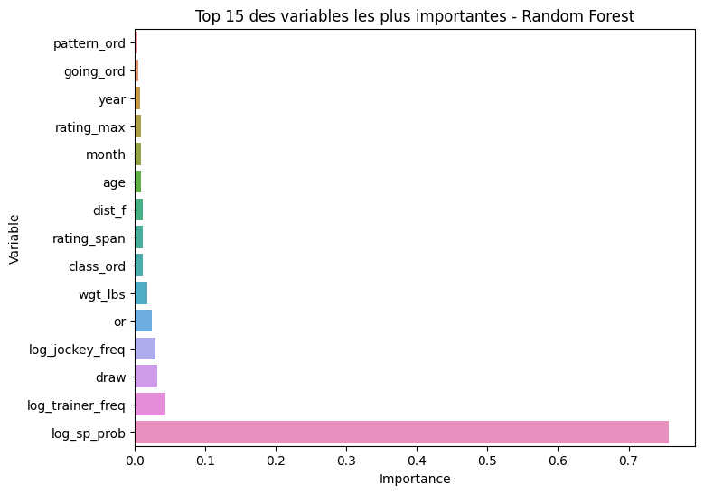

Les résultats montrent que certaines variables jouent un rôle central dans la prédiction, notamment celles liées :

au marché des paris (sp_prob)
aux performances passées (or)
aux caractéristiques du jockey et de l’entraîneur

Afin de compléter cette analyse, une importance par permutation a également été calculée.

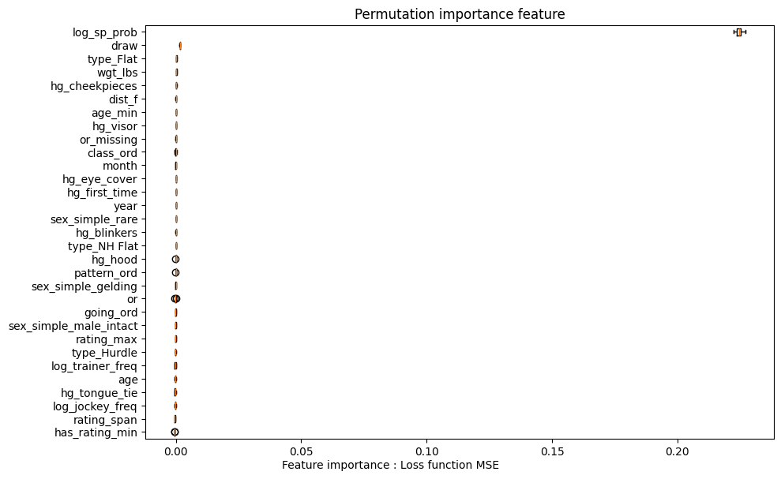

Cette méthode confirme globalement les résultats précédents, tout en offrant une mesure plus robuste de l’impact réel des variables sur la performance du modèle.

### 6.2. Analyse globale avec SHAP

L’approche SHAP permet d’analyser la contribution moyenne des variables aux prédictions.

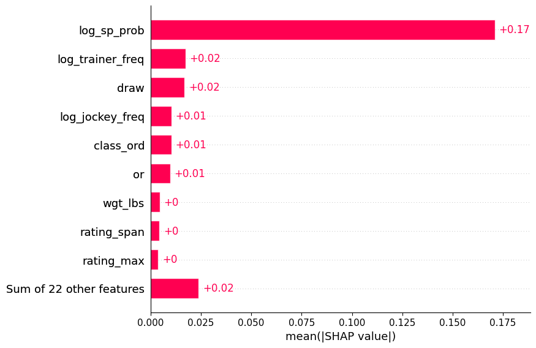

Le graphique ci-dessus présente l’importance moyenne des variables, mesurée par la valeur absolue des contributions SHAP. On observe très nettement que la variable log_sp_prob domine largement les autres, avec une contribution moyenne significativement plus élevée. Cela confirme que les probabilités issues du marché des paris constituent le principal déterminant de la performance prédite.

Les autres variables ont une influence beaucoup plus modérée. Parmi elles, log_trainer_freq, draw, log_jockey_freq, class_ord et or apparaissent comme les variables secondaires les plus importantes, bien que leur contribution reste faible en comparaison de log_sp_prob.

Cette hiérarchie met en évidence une forte concentration de l’information prédictive sur un petit nombre de variables.

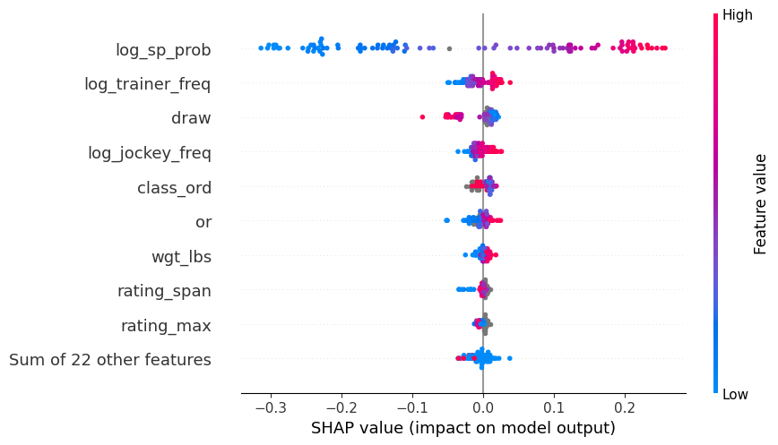

Le graphique de type beeswarm permet d’aller plus loin en analysant le sens de l’effet des variables.

Concernant **log_sp_prob**, on observe une relation très claire :

- des valeurs élevées (en rouge) sont associées à des contributions positives importantes
- des valeurs faibles (en bleu) sont associées à des contributions négatives

Cela signifie que plus la probabilité implicite du marché est élevée, plus la probabilité prédite d’être dans le top 3 augmente, ce qui est cohérent avec l’interprétation économique de cette variable.

Pour les autres variables, les effets apparaissent plus diffus et moins structurés. Par exemple, `log_trainer_freq` et `log_jockey_freq` montrent des contributions globalement positives pour les valeurs élevées, suggérant qu’un entraîneur ou un jockey performant augmente les chances de succès. En revanche, certaines variables comme `draw` ou `wgt_lbs` présentent des effets plus hétérogènes, traduisant des relations plus complexes ou dépendantes du contexte.

Dans l’ensemble, cette analyse confirme que la prédiction repose principalement sur l’information issue du marché des paris, tandis que les autres variables apportent un complément d’information plus diffus. 

### 6.3. Analyse locale (interprétation individuelle)

Afin de comprendre la prédiction pour un individu donné, une analyse locale a été réalisée à l’aide d’un graphique de type waterfall.

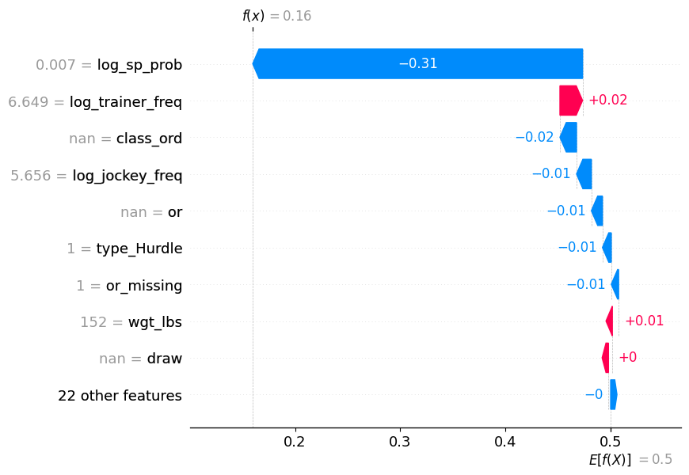

Le graphique de type waterfall permet de décomposer la prédiction du modèle pour un cheval spécifique en contributions individuelles de chaque variable.

La valeur de base du modèle (probabilité moyenne) est d’environ 0,5, qui correspond à une situation neutre. Pour l’individu étudié, la probabilité prédite d’être dans le top 3 est de 0,16, ce qui indique une faible probabilité de performance.

Cette baisse importante s’explique principalement par la variable `log_sp_prob`, qui contribue fortement de manière négative (-0,31). Cela signifie que le marché des paris attribue une faible probabilité de succès à ce cheval, ce qui influence fortement la prédiction du modèle.

Les autres variables ont des effets plus modestes :

`log_trainer_freq` contribue légèrement positivement (+0,02), suggérant un entraîneur relativement performant
plusieurs variables comme `class_ord`, `log_jockey_freq`, `or` ou encore `type_Hurdle` ont des contributions négatives faibles, qui viennent renforcer la probabilité de non-performance
la variable `or_missing` a également un effet négatif, ce qui peut refléter un manque d’information ou d’expérience du cheval

Globalement, la prédiction est dominée par l’effet de `log_sp_prob`, tandis que les autres variables ajustent marginalement cette estimation.

### 6.4. Analyse des effets des variables (PDP et ALE)

Afin d’analyser l’effet des variables sur la prédiction du modèle, des graphiques de dépendance partielle (PDP) et des effets locaux accumulés (ALE) ont été utilisés.

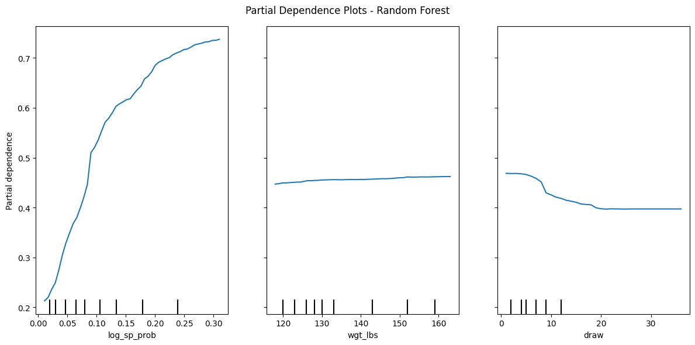

Les PDP mettent en évidence une relation croissante entre `log_sp_prob` et la probabilité d’être dans le top 3. Plus la probabilité implicite issue du marché est élevée, plus la probabilité prédite augmente fortement, avec un effet particulièrement marqué pour les valeurs intermédiaires. Cela confirme le rôle central de cette variable dans le modèle.

La variable `wgt_lbs` présente un effet beaucoup plus modéré, suggérant une influence limitée du poids porté sur la performance. En revanche, draw montre une relation décroissante : certaines positions de départ semblent associées à une probabilité plus faible de terminer dans le top 3.

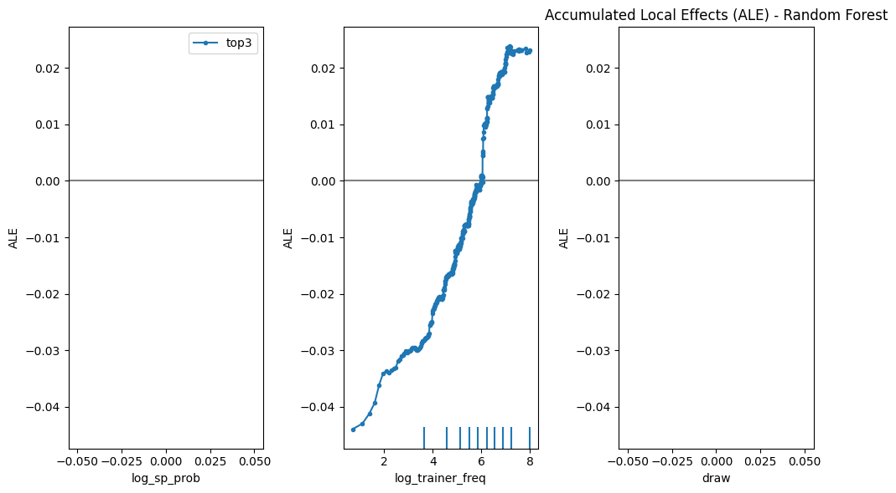

Les graphiques ALE confirment globalement ces tendances, tout en offrant une estimation plus robuste en présence de corrélations entre variables. En particulier, l’effet positif de `log_trainer_freq` apparaît clairement : plus l’entraîneur est performant, plus la probabilité de succès augmente.

En revanche, certaines variables présentent des effets quasi nuls ou peu interprétables, ce qui suggère qu’elles jouent un rôle secondaire dans la prédiction.

Dans l’ensemble, ces résultats confirment que seules quelques variables ont un impact structurant sur la prédiction, tandis que les autres contribuent de manière plus marginale.

### 6.5. Analyse de l’hétérogénéité (ICE)

Les courbes ICE (Individual Conditional Expectation) permettent d’analyser l’effet des variables à l’échelle individuelle, en mettant en évidence la variabilité des réponses du modèle selon les observations.

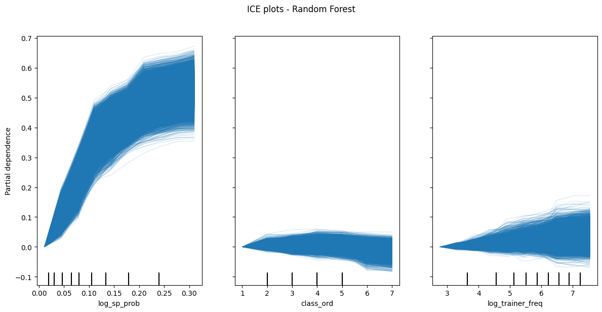

Concernant log_sp_prob, les courbes présentent une tendance globalement croissante, ce qui confirme les résultats observés précédemment. Toutefois, on observe une dispersion non négligeable entre les courbes, indiquant que l’effet de cette variable varie selon les profils de chevaux. Cela suggère l’existence d’interactions avec d’autres variables.

Pour class_ord, les courbes sont relativement plates et peu dispersées, ce qui confirme que cette variable a un impact limité sur la prédiction, avec peu d’hétérogénéité entre individus.

Enfin, log_trainer_freq présente une variabilité plus marquée : certaines courbes montrent un effet positif, tandis que d’autres sont plus neutres, voire légèrement négatives. Cela indique que l’impact de l’entraîneur dépend du contexte spécifique de chaque observation.

Dans l’ensemble, ces résultats mettent en évidence que, si certaines variables ont un effet moyen clair, leur impact peut varier significativement selon les individus,

### 5.5. Analyse complémentaire des performances
 
Afin de compléter l’évaluation des performances du modèle retenu (Random Forest), des courbes ROC et Precision-Recall ont été analysées.

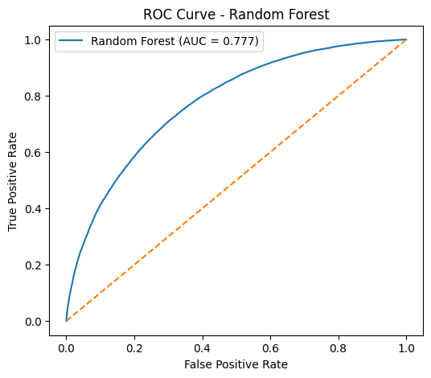

La courbe ROC montre que le modèle présente une bonne capacité de discrimination entre les classes, avec une aire sous la courbe (AUC) de 0,777. La courbe s’éloigne significativement de la diagonale, ce qui indique que le modèle est capable de distinguer efficacement les chevaux terminant dans le top 3 des autres.

La courbe Precision-Recall (dans le fichier code) permet d’analyser plus finement le compromis entre précision et rappel. On observe que la précision diminue progressivement à mesure que le rappel augmente, ce qui traduit un arbitrage classique dans les modèles de classification. Le score AP (0,605) confirme une performance correcte dans la détection des chevaux performants.

Ces résultats confirment que le modèle présente une capacité de prédiction satisfaisante, tout en mettant en évidence les limites inhérentes au compromis entre détection et précision.

---

## 7. Conclusion
Ce projet avait pour objectif de prédire la probabilité qu’un cheval termine parmi les trois premiers d’une course hippique, à partir d’un ensemble de variables décrivant à la fois les caractéristiques du cheval, de la course et les informations issues du marché des paris.

Les résultats obtenus montrent que plusieurs modèles permettent d’atteindre des performances satisfaisantes, avec des scores relativement proches. Les modèles non linéaires, en particulier Random Forest et XGBoost, se distinguent par leur capacité à capturer des relations complexes entre les variables, confirmant l’importance des effets non linéaires dans ce type de problématique.

L’analyse des variables met en évidence le rôle central de l’information issue du marché des paris (sp_prob), qui constitue de loin le principal déterminant de la performance prédite. Les autres variables, telles que les caractéristiques du jockey, de l’entraîneur ou du cheval, apportent une information complémentaire mais plus diffuse.

Toutefois, cette forte dépendance à une variable issue du marché soulève une limite importante : une grande partie de l’information prédictive semble déjà intégrée dans les cotes, ce qui réduit la capacité du modèle à générer une véritable valeur ajoutée prédictive indépendante.

Par ailleurs, certaines limites doivent être soulignées. D’une part, le modèle reste dépendant de la qualité et de la complétude des données disponibles. D’autre part, certaines variables potentiellement pertinentes (conditions météorologiques fines, forme récente détaillée, stratégie de course) ne sont pas prises en compte. Enfin, l’évaluation repose sur des données historiques et ne garantit pas nécessairement la stabilité des performances dans un contexte futur.

Des prolongements pourraient consister à enrichir les données, à intégrer des variables temporelles plus fines, ou encore à explorer des approches plus avancées (modèles séquentiels, deep learning) afin de mieux capturer la dynamique des performances.

